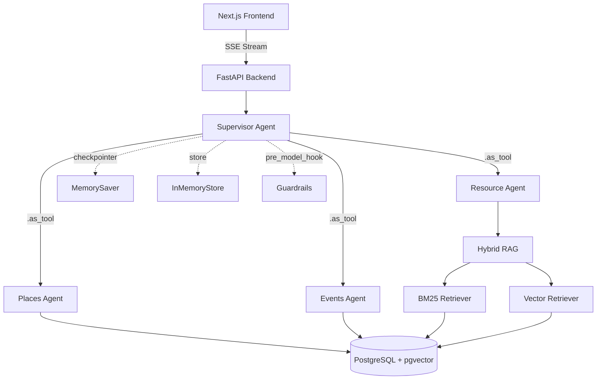

# BU Life AI

> A GenAI campus assistant that helps Boston University students navigate campus life — from finding study spots to understanding OPT policies — powered by a multi-agent supervisor architecture.

- **Multi-agent system** — supervisor routes queries to specialized sub-agents (places, resources, events) using LangGraph
- **Hybrid RAG pipeline** — BM25 keyword + vector semantic retrieval with RAGAS-evaluated accuracy
- **Production-ready** — streaming responses, conversational memory, structured output, guardrails, deployed on AWS


---

## What It Does

Students ask natural language questions — the agent figures out the intent, calls the right tools, and returns grounded answers:

- *"I have 25 mins near CDS, where can I eat?"*
- *"Find me a quiet study spot near CAS with outlets"*
- *"How do I apply for OPT as an F-1 student?"*
- *"Any AI or startup events this week?"*

---

## Architecture



---

## 7 Agentic Features

| # | Feature | Implementation | LangGraph API |
|---|---------|---------------|---------------|
| 1 | **Multi-Agent Supervisor** | 3 sub-agents converted to tools | `create_react_agent` + `.as_tool()` |
| 2 | **Conversational Memory** | Thread-isolated chat history | `MemorySaver` checkpointer |
| 3 | **Self-Correcting Loop** | Tools return retry guidance on empty results | ReAct loop + smart tool returns |
| 4 | **Structured Output** | Pydantic model for typed responses | `response_format=AgentResponse` |
| 5 | **Parallel Tool Execution** | LLM calls multiple tools per turn | Native `ToolNode` |
| 6 | **Semantic Caching** | Cross-thread user preference store | `InMemoryStore` |
| 7 | **Input Guardrails** | Block prompt injection before LLM | `pre_model_hook` + `trim_messages` |

---

## Tech Stack

| Layer | Technology |
|-------|-----------|
| Frontend | Next.js 14, Tailwind CSS, SSE streaming |
| Backend | FastAPI, Python 3.12 |
| AI Agent | LangGraph supervisor, LangChain LCEL |
| LLM | AWS Bedrock — Claude 3 Haiku |
| Embeddings | AWS Bedrock — Titan Embed Text v1 |
| RAG | EnsembleRetriever (BM25 40% + vector 60%) |
| Database | PostgreSQL 15, pgvector |
| Observability | LangSmith tracing (zero code) |
| CI/CD | GitHub Actions |

---

## RAG Evaluation (RAGAS)

Ablation study over 20 BU-specific questions:

| Experiment | Faithfulness | Context Precision | Context Recall |
|------------|-------------|-------------------|----------------|
| Baseline (vector, 15 pages) | 0.93 | 0.05 | 0.07 |
| Expanded corpus (vector, 51 pages) | 0.97 | 0.14 | **0.13** |
| Hybrid search (BM25+vector, 15 pages) | 0.98 | 0.10 | 0.12 |
| Both (BM25+vector, 51 pages) | 0.93 | **0.15** | 0.09 |

Expanded corpus drove the biggest gain in recall. Hybrid search improved precision for acronym-heavy queries (OPT, CPT, FAFSA).

> Run evals: `cd backend && python eval/run_eval.py`

---

## Quick Start

**1. Database**
```bash
psql postgres -c "CREATE DATABASE bulife;"
psql bulife -c "CREATE EXTENSION IF NOT EXISTS vector;"
psql bulife < backend/app/db/schema.sql
```

**2. Backend**
```bash
cd backend
python -m venv venv && source venv/bin/activate
pip install -r requirements.txt
cp .env.example .env   # add AWS credentials
python -m app.db.seed_data
uvicorn app.main:app --reload --port 8000
```

**3. Frontend**
```bash
cd frontend
npm install
cp .env.local.example .env.local
npm run dev
```

Open `http://localhost:3000`

---

## Deploy

| Component | Platform | Config |
|-----------|----------|--------|
| Backend | AWS EC2 (Docker) | `backend/Dockerfile` |
| Frontend | Netlify | `frontend/netlify.toml` |
| Database | Neon PostgreSQL | Connection string in `DATABASE_URL` |
| Tracing | LangSmith | Set `LANGCHAIN_TRACING_V2=true` in env |

```bash
# Backend on EC2
docker build -t bulife-backend ./backend
docker run -p 8000:8000 --env-file backend/.env bulife-backend
```
